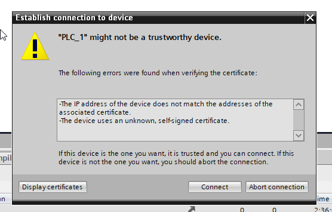
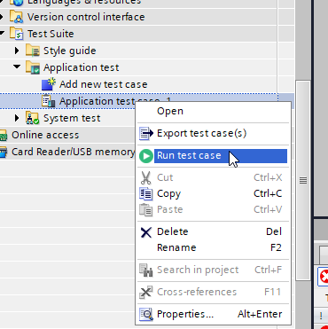
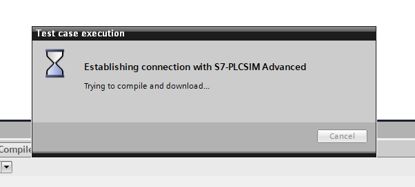
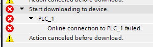
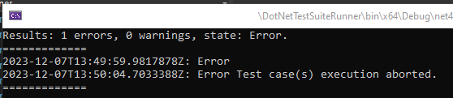

# Problem description

Running unit tests via the Openness API is not possible, it will always result into errors. If the same tests are run via the IDE, they succeed as expected.

The attached source code contains all what is necessary: A Siemens V18 PLC project and a C# console application which will run the test.

## Background information

We suspect the following dialog to be the problem;

This dialog pops up when running the test via the IDE:

Once *Connect* has clicked, it won't appear again. However, this doesn't fix it when running via the Openness API.

When running via the Openness API you will see some time this dialog:

However, it will fail after a time:

A solution via [https://support.industry.siemens.com/cs/mdm/109815199?c=146149102475&lc=en-NL](https://support.industry.siemens.com/cs/mdm/109815199?c=146149102475&lc=en-NL) doesn't seem to integrate with the `TestCaseExecutor.Run` method? Because this method creates a (temporarily) instance on PLC Sim Advanced. Although, that is what we suspect, but don't know.

## Question

In [Program.cs](DotNetTestSuiteRunner/DotNetTestSuiteRunner/Program.cs) there's a line where `TestCaseExecutor.Run` is called, what is necessary to make this call returning a successfull test case just like calling it via the IDE?